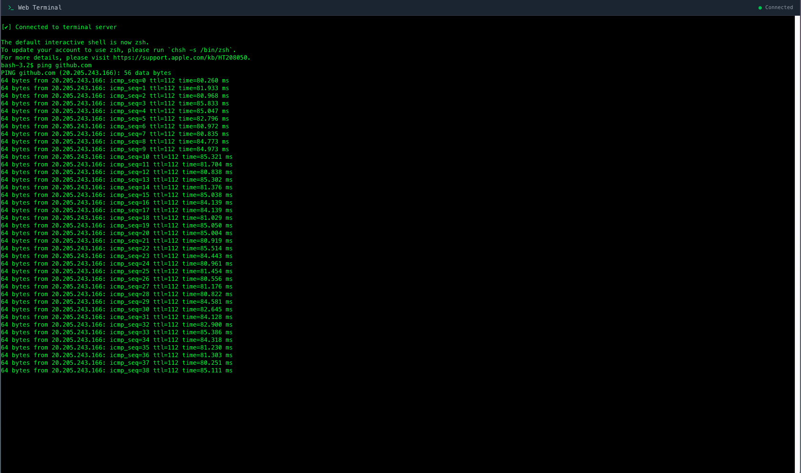
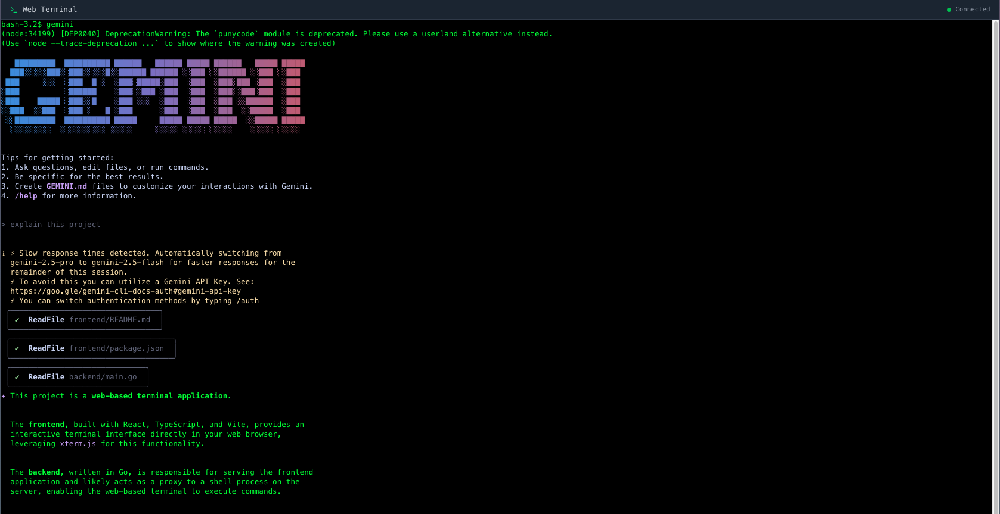
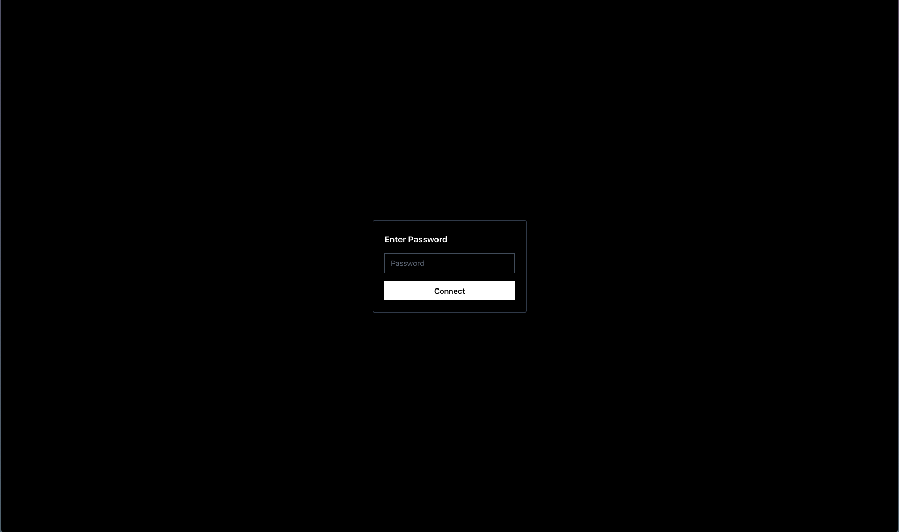

# 🌐 WebTerminal: Your Terminal, Anywhere, Anytime! 🚀

Are you tired of juggling SSH clients or struggling to access your remote machines on the go? Look no further! WebTerminal brings the power of your command line directly to your web browser, offering a seamless and secure way to interact with your servers, including your beloved droplets! 💻✨

## ✨ Features

- **Browser-Based Access:** Execute commands, manage files, and monitor processes directly from your web browser.
- **Real-time Interaction:** Powered by WebSockets, enjoy a fluid and responsive terminal experience.
- **Secure Connection:** Built with security in mind, ensuring your commands and data are protected.
- **Cross-Platform Compatibility:** Access your terminal from any device with a modern web browser.
- **Open Source:** Fully transparent and extensible, allowing you to customize and contribute!

## 💡 Use Cases

- **Droplet Management:** Easily connect to and manage your DigitalOcean droplets without needing an SSH client.
- **Remote Server Administration:** Administer any Linux server from a convenient web interface.
- **On-the-Go Development:** Quickly fix bugs or deploy updates from your tablet or even your phone!
- **Educational Purposes:** Provide a sandboxed terminal environment for learning and experimentation.

## 🛠️ Technologies Used

- **Frontend:** React.js (TypeScript) ⚛️
- **Backend:** Go 🐹
- **Real-time Communication:** WebSockets ⚡

## 🚀 Getting Started

### Prerequisites

- Node.js & npm/yarn (for frontend)
- Go (for backend)

### Installation

1. **Clone the repository:**

   ```bash
   git clone https://github.com/your-username/web-terminal.git
   cd web-terminal
   ```

2. **Backend Setup:**

   ```bash
   cd backend
   go mod tidy
   go build -o webterminal-server .
   # Or run directly:
   # go run main.go
   ```

3. **Frontend Setup:**
   ```bash
   cd frontend
   npm install # or yarn install
   npm run build # or yarn build
   ```

### Running the Application

1. **Start the Backend Server:**

   ```bash
   cd backend
   ./webterminal-server # or go run main.go
   ```

2. **Start the Frontend Development Server (for development):**
   ```bash
   cd frontend
   npm run dev # or yarn dev
   ```

### Building for Production

To build the entire application for production, simply run the `build.sh` script from the project root:

```bash
./build.sh
```

This script will:

1. Build the frontend assets.
2. Copy the frontend assets to the backend's `web` directory.
3. Build the Go backend executable.

After running the script, you will find the `web-terminal` executable in the project root directory. You can then run this executable to start the server.

## 📸 Screenshots







## 🤝 Contributing

We welcome contributions! If you have ideas for new features, bug fixes, or improvements, please open an issue or submit a pull request. See our `CONTRIBUTING.md` (coming soon!) for more details.

## 📄 License

This project is open-source and available under the [MIT License](LICENSE).
